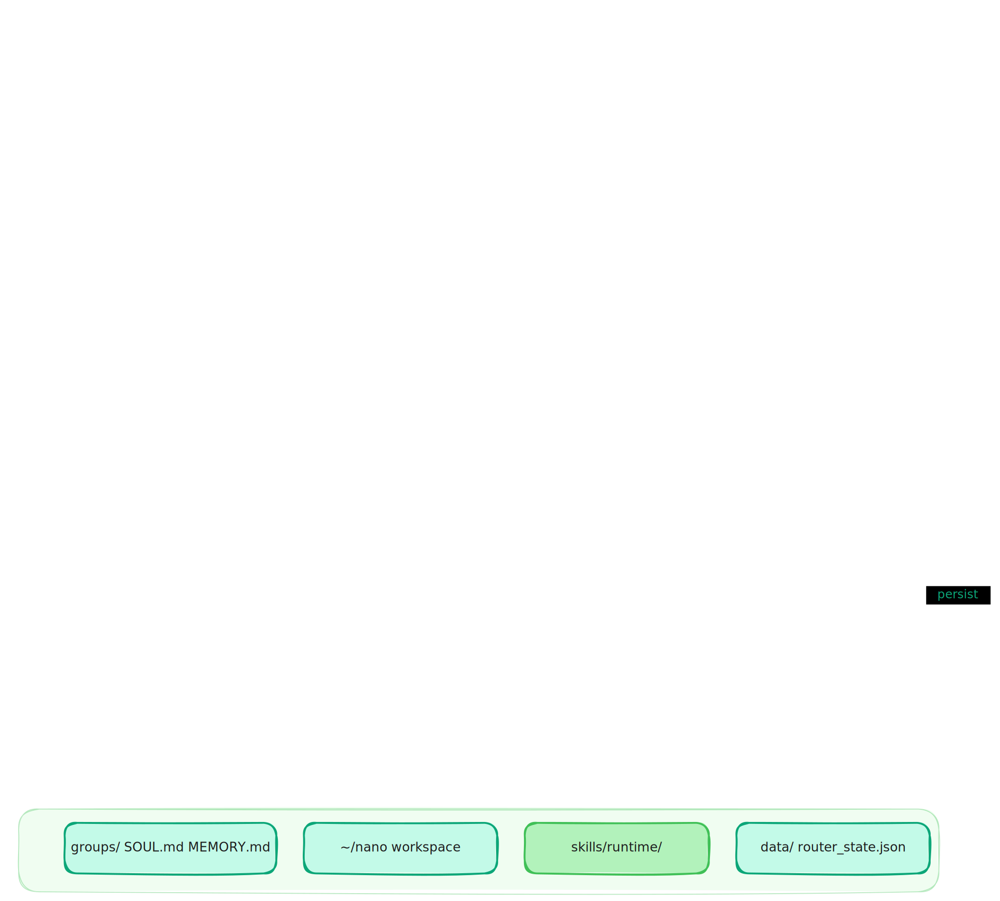

# nano-core

[](https://github.com/0-CYBERDYNE-SYSTEMS-0/nano-core/releases)
[](https://github.com/0-CYBERDYNE-SYSTEMS-0/nano-core/actions/workflows/release-readiness.yml)
[](LICENSE)

An autonomous AI coworker that runs on your hardware. It learns your operation, texts you updates, writes code to automate your equipment, and gets smarter over time. No subscriptions. No cloud dependency. MIT licensed.

## Quick Start

```bash
curl -fsSL https://raw.githubusercontent.com/0-CYBERDYNE-SYSTEMS-0/nano-core/main/scripts/install.sh | bash
```

Runs on Raspberry Pi, your own server, or local hardware. Chat via Telegram or WhatsApp.

## Key Capabilities

| Persistent Memory | Equipment Control | Multi-Provider AI |
|-------------------|-------------------|-------------------|
| Carries context across sessions. Learns your operation over time. | Discovers and controls equipment via Telegram. Writes automation code automatically. | OpenAI, OpenCode Go, Anthropic, Gemini, OpenRouter, Ollama, LM Studio. Local-first. |

## Proven

Built with 24 years of field experience. Three years of real operational testing. Designed for real operations running real equipment.

## Project Status

- Official distribution: **GitHub Releases**
- `npm install` is not the primary install path yet
- See `docs/RELEASE.md` for current release process

**Links:** [Releases](https://github.com/0-CYBERDYNE-SYSTEMS-0/nano-core/releases) | [Security](.github/SECURITY.md) | [Contributing](CONTRIBUTING.md) | [Docs](docs/)
- Support: `SUPPORT.md`
- Changelog: `CHANGELOG.md`

## Quickstart (Primary UX Path)

This is the canonical install-and-run flow.

### 1. Run the installer

```bash
curl -fsSL https://get.nano-core.dev/install.sh | bash
```

The installer downloads the latest stable release, installs missing basics where it can, chooses Docker when it is already healthy, falls back to host runtime when Docker is unavailable, then runs `./scripts/onboard-all.sh`.

Developer/manual install:

```bash
git clone https://github.com/0-CYBERDYNE-SYSTEMS-0/nano-core.git
cd nano-core
./scripts/onboard-all.sh
```

The guided flow performs:

- safety backup (`~/nano`, `.env`, `data/`, `groups/`)
- dependency install (`npm ci` when lockfile exists)
- `npm run typecheck`
- `npm run build`
- pinned `~/.local/bin/fft` launcher plus global CLI link (`npm link`) so `fft ...` commands are available
- runtime prep:
  - Docker runtime: build agent image with the repo-pinned `pi` coding agent package
  - Host runtime: use the repo-local `node_modules/.bin/pi` before any global `pi`
- `.env` scaffold from `.env.example` (if missing)
- mount allowlist scaffold at `~/.config/nano-core/mount-allowlist.json` (if missing)
- onboarding wizard (`risk gate`, `quickstart|advanced`, `local|remote`, provider/channel/hatch)
- host service step (`install/start` by default, with `--no-install-daemon` support)
- workspace onboarding/bootstrap seed (`NANO.md`, `SOUL.md`, `TODOS.md`, `HEARTBEAT.md`, `MEMORY.md`; preserves `BOOTSTRAP.md` for first-run ritual and `BOOT.md` when enabled)
- doctor health check

Profile defaults:
- fresh installs default to `core` profile
- existing installs preserve their profile when signals/artifacts are detected

If you are upgrading an existing install and want to preserve all local state (`~/nano`, `.env`, `data/`, `groups/`) before changes:

```bash
npm run backup:state
# dry-run preview:
npm run backup:state -- --dry-run
```

Backups are written to `./backups/` by default.

Choose runtime at install time:

```bash
# isolated Docker runtime
curl -fsSL https://get.nano-core.dev/install.sh | bash -s -- --runtime docker

# host runtime fallback
curl -fsSL https://get.nano-core.dev/install.sh | bash -s -- --runtime host
```

### All Setup Options

`./scripts/onboard-all.sh` accepts the following options:

| Option | Description |
|--------|-------------|
| `--workspace <dir>` | Main workspace path (default: ~/nano) |
| `--env-path <file>` | Path to .env file |
| `--operator <name>` | Primary operator name |
| `--assistant-name <name>` | Assistant name |
| `--accept-risk` | Acknowledge risk before onboarding |
| `--flow <flow>` | quickstart, advanced, or manual |
| `--mode <mode>` | local or remote |
| `--runtime <runtime>` | auto, docker, or host |
| `--auth-choice <choice>` | openai, opencode-go, lm-studio, anthropic, gemini, openrouter, zai, minimax, kimi-coding, ollama, or skip |
| `--model <id>` | Model ID (e.g. gpt-4o-mini, claude-3-5-sonnet-20241022) |
| `--api-key <token>` | Provider API key |
| `--remote-url <url>` | Remote gateway URL (remote mode) |
| `--gateway-port <port>` | Gateway/TUI port hint |
| `--telegram-token <token>` | Telegram bot token |
| `--telegram-main-chat-id <id>` | Pre-set Telegram main chat ID (skips /main claim) |
| `--whatsapp-enabled <0\|1>` | Enable or disable WhatsApp channel |
| `--hatch <choice>` | tui, web, or later |
| `--install-daemon` | Install/start host service after onboarding |
| `--no-install-daemon` | Skip service install/start |
| `--skip-channels` | Skip Telegram/WhatsApp channel prompts |
| `--skip-skills` | Skip skills prompts |
| `--skip-health` | Skip health prompts and checks |
| `--skip-ui` | Skip hatch (TUI/Web) prompts |
| `--skip-setup` | Skip deps/build/image/service install |
| `--skip-restart` | Skip service restart after onboarding |
| `--skip-doctor` | Skip doctor health check at end |
| `--no-backup` | Skip safety backup step |
| `--backup-out-dir <dir>` | Custom backup output directory |
| `--non-interactive` | Require explicit --operator and --assistant-name |
| `--force` | Force rewrite of onboarding identity files |
| `--help, -h` | Show full help |

### 2. Configure `.env` (minimum required)

At minimum set provider runtime values plus Telegram credentials.

Example (OpenAI + Telegram):

```dotenv
FFT_NANO_RUNTIME_PROVIDER_PRESET=openai
PI_API=openai
PI_MODEL=gpt-4o-mini
OPENAI_API_KEY=replace-me
TELEGRAM_BOT_TOKEN=replace-me
TELEGRAM_ADMIN_SECRET=replace-me
```

Recommended provider paths:

- OpenAI: `PI_API=openai`, `PI_MODEL=...`, `OPENAI_API_KEY=...`
- LM Studio (local): `FFT_NANO_RUNTIME_PROVIDER_PRESET=lm-studio`, `PI_API=openai`, `PI_MODEL=...`, `OPENAI_BASE_URL=http://127.0.0.1:1234/v1`, `PI_API_KEY=lm-studio`
- Ollama (local): `FFT_NANO_RUNTIME_PROVIDER_PRESET=ollama`, `PI_API=ollama`, `PI_MODEL=...`, `OPENAI_BASE_URL=http://localhost:11434/v1`, `PI_API_KEY=ollama`
- Anthropic: `PI_API=anthropic`, `PI_MODEL=...`, `ANTHROPIC_API_KEY=...`
- Gemini: `PI_API=gemini`, `PI_MODEL=...`, `GEMINI_API_KEY=...`
- OpenRouter: `PI_API=openrouter`, `PI_MODEL=...`, `OPENROUTER_API_KEY=...`
- OpenCode Go: `FFT_NANO_RUNTIME_PROVIDER_PRESET=opencode-go`, `PI_API=opencode-go`, `PI_MODEL=deepseek-v4-pro`, `OPENCODE_API_KEY=...`

After editing `.env`, apply it by restarting the host:

```bash
./scripts/service.sh restart
# or, after `npm link`: fft service restart
```

### 3. Verify service health

```bash
./scripts/service.sh status
./scripts/service.sh logs
# or, after `npm link`: fft service status && fft service logs
```

If you disabled auto-service during setup (`FFT_NANO_AUTO_SERVICE=0`), install/start it manually:

```bash
./scripts/service.sh install
# or, after `npm link`: fft service install
```

### 4. Attach the TUI

`fft` CLI should already be installed by setup as a pinned launcher:

```bash
~/.local/bin/fft tui
```

The setup script also adds `~/.local/bin` to your shell PATH, so new terminals can run `fft ...` from any directory. If needed, relink the npm CLI manually:

```bash
npm link
```

Attach the terminal UI:

```bash
fft tui
# or: ./scripts/start.sh tui
```

Important: `fft tui` is an attach client. The host process must already be running.
The pinned launcher created by setup targets the installed checkout from any directory. Use `--repo` to target another checkout:

```bash
fft --repo /absolute/path/to/nano-core tui
```

If you prefer the linked CLI form, use:

```bash
fft onboard
```

### 4b. Open FFT CONTROL CENTER (Web UI)

The web dashboard is served by the same running host process.

```bash
fft web
# or: ./scripts/web.sh
```

By default it listens on `http://127.0.0.1:28990`.

### 5. Claim Telegram as main/admin

In the bot DM:

1. Run `/id` to confirm chat id.
2. Run `/main <secret>` using `TELEGRAM_ADMIN_SECRET`.
   - First-claim shortcut: if no main chat exists yet, and `TELEGRAM_ADMIN_SECRET` is unset, a direct Telegram DM can claim main with `/main`. Set `TELEGRAM_ADMIN_SECRET` afterward and restart.

Once claimed:

- main chat responds to all messages
- non-main chats require trigger `@<ASSISTANT_NAME>`
- admin controls (`/gateway`, `/tasks`, `/coder`, `/freechat`) are main-only

### Unified Command Reference

The `fft` CLI is the primary interface after install. When CLI linking is unavailable (`FFT_NANO_AUTO_LINK=0`), substitute `./scripts/start.sh ...` and `./scripts/service.sh ...` equivalents.

**fft subcommands:**

| Command | Description |
|---------|-------------|
| `fft onboard [options]` | Run the full guided onboarding flow |
| `fft profile <status\|set\|apply> [core]` | Show or switch operator/assistant profile |
| `fft start [telegram-only]` | Start the host service |
| `fft dev [telegram-only]` | Start in development mode |
| `fft tui [--url ws://127.0.0.1:28989] [--session main] [--deliver]` | Attach the terminal UI |
| `fft web [--open]` | Open the FFT Control Center web UI |
| `fft doctor [--json]` | Run health diagnostics |
| `fft service <install\|uninstall\|start\|stop\|restart\|status\|logs>` | Manage the host service |

**fft onboard options** (same as `./scripts/onboard-all.sh`):

| Option | Description |
|--------|-------------|
| `--workspace <dir>` | Main workspace path |
| `--env-path <file>` | Path to .env file |
| `--operator <name>` | Primary operator name |
| `--assistant-name <name>` | Assistant name |
| `--non-interactive` | Require explicit operator/assistant-name |
| `--accept-risk` | Acknowledge risk before onboarding |
| `--flow <flow>` | quickstart, advanced, or manual |
| `--mode <mode>` | local or remote |
| `--runtime <runtime>` | auto, docker, or host |
| `--auth-choice <choice>` | openai, opencode-go, lm-studio, anthropic, gemini, openrouter, zai, minimax, kimi-coding, ollama, skip |
| `--model <id>` | Model ID |
| `--api-key <token>` | Provider API key |
| `--remote-url <url>` | Remote gateway URL (remote mode) |
| `--gateway-port <port>` | Gateway/TUI port hint |
| `--telegram-token <token>` | Telegram bot token |
| `--telegram-main-chat-id <id>` | Pre-set main chat ID |
| `--whatsapp-enabled <0\|1>` | Enable/disable WhatsApp |
| `--hatch <choice>` | tui, web, or later |
| `--install-daemon` | Install/start service after onboarding |
| `--no-install-daemon` | Skip service install/start |
| `--skip-channels` | Skip channel prompts |
| `--skip-skills` | Skip skills prompts |
| `--skip-health` | Skip health prompts and checks |
| `--skip-ui` | Skip hatch prompts |
| `--skip-setup` | Skip deps/build/image install |
| `--skip-restart` | Skip service restart after onboarding |
| `--skip-doctor` | Skip doctor health check at end |
| `--no-backup` | Skip safety backup |
| `--backup-out-dir <dir>` | Custom backup directory |
| `--force` | Force rewrite of identity files |
| `--help, -h` | Show full help |

**Maintenance:**

```bash
# Full onboard with explicit args
./scripts/onboard-all.sh --workspace /abs/path --env-path /abs/path/.env \
  --operator "Name" --assistant-name "AssistantName" \
  --non-interactive --accept-risk \
  --runtime docker --auth-choice openai --model gpt-4o-mini \
  --api-key "sk-..." --telegram-token "..." \
  --install-daemon

# Backup state before upgrades
npm run backup:state -- --workspace ~/nano --out-dir ./backups --dry-run
npm run backup:state -- --workspace ~/nano --out-dir ./backups

# Restore from backup
npm run restore:state -- --archive ./backups/backup-YYYYMMDD-HHMMSS.tar.gz
```

Config edit note:

- There is no separate `fft config` command in this repo.
- `fft onboard` runs the full guided wrapper (`onboard-all` path).
- Use `./scripts/onboard.sh` for wizard-only edits.

TUI slash commands:

- `/help`
- `/status`
- `/sessions`
- `/session <key>`
- `/history [limit]`
- `/model <provider/model|model>`
- `/think <off|minimal|low|medium|high|xhigh>`
- `/reasoning <off|on|stream>`
- `/verbose [off|new|all|verbose]`
- `/deliver <on|off>`
- `/gateway <status|restart|doctor>`
- `/new` (or `/reset`)
- `/abort`
- `/exit`

Telegram commands (main/admin subset):

- `/help`
- `/status`
- `/id`
- `/models [query]`
- `/main <secret>`
- `/gateway <status|restart|doctor>`
- `/restart` (alias for `/gateway restart`)
- `/coder <task>`
- `/coder-plan <task>`
- `/tasks [list|due|detail <id>|runs <id> [limit]]`

Model selection note:

- `/models` without a query opens the model provider picker panel directly.
- `/models <query>` searches and lists models matching the query text.

Tool progress notes:

- `/verbose` cycles `off -> new -> all -> verbose`.
- `/verbose <off|new|all|verbose>` sets the mode explicitly.
- Telegram uses a separate progress bubble that is edited as tool calls arrive.

Service-control note:

- Linux may require elevated privileges for some service actions.
- Runtime `/gateway` commands are non-interactive and cannot prompt for sudo/password.
- If privilege escalation is required, run `./scripts/service.sh ...` (or `fft service ...`) directly in a shell with sufficient permissions.

TUI keybinds:

- `Esc`: abort active run
- `Ctrl+C`: clear input (press twice quickly to exit)
- `Ctrl+D`: exit
- `Ctrl+T`: quick status
- `Ctrl+P`: quick sessions

TUI gateway env:

- `FFT_NANO_TUI_PORT` (default `28989`)
- `FFT_NANO_TUI_HOST` (default `127.0.0.1`, uses `0.0.0.0` in LAN/remote web modes)
- `FFT_NANO_TUI_ENABLED` (`1` default, set `0` to disable)
- `FFT_NANO_TUI_AUTH_TOKEN` (optional, defaults to `FFT_NANO_WEB_AUTH_TOKEN` when set)

FFT CONTROL CENTER env:

- `FFT_NANO_WEB_ENABLED` (`1` default)
- `FFT_NANO_WEB_ACCESS_MODE` (`localhost|lan|remote`, default `localhost`)
- `FFT_NANO_WEB_HOST` (default `127.0.0.1` for localhost mode, else `0.0.0.0`)
- `FFT_NANO_WEB_PORT` (default `28990`)
- `FFT_NANO_WEB_AUTH_TOKEN` (required for `lan` and `remote` modes)

TUI troubleshooting:

- `connect ECONNREFUSED 127.0.0.1:28989`: host is not running, wrong `FFT_NANO_TUI_PORT`, or gateway disabled.
- `EADDRINUSE` in host logs: selected TUI port is already in use; change `FFT_NANO_TUI_PORT`.
- `unknown session: main`: no main chat is registered yet; use `/sessions` and switch to an available session.

If WhatsApp is enabled, authenticate once before first full run:

```bash
npm run auth
```

## Platform Notes

### macOS

- Docker is the default runtime.
- Ensure daemon health before start:

```bash
docker info
```

- Optional advanced mode: unisolated host runtime (explicit opt-in)
  - `CONTAINER_RUNTIME=host`
  - `FFT_NANO_ALLOW_HOST_RUNTIME=1`
  - for production use additionally set `FFT_NANO_ALLOW_HOST_RUNTIME_IN_PROD=1`

### Linux

- Docker is used by default.
- Ensure daemon health before start:

```bash
docker info
```

## Raspberry Pi Startup (Raspberry Pi OS 64-bit)

nano-core runs on Pi as a Linux Docker deployment.

Canonical Pi guide (full runbook):
- `docs/RASPBERRY_PI.md`

Pi summary (aligned with the primary flow):

```bash
sudo apt update
sudo apt install -y git curl ca-certificates
curl -fsSL https://deb.nodesource.com/setup_20.x | sudo -E bash -
sudo apt install -y nodejs
node -v
curl -fsSL https://get.docker.com | sh
sudo usermod -aG docker "$USER"
# log out/in (or reboot), then:
sudo systemctl enable --now docker
docker info
git clone https://github.com/0-CYBERDYNE-SYSTEMS-0/nano-core.git
cd nano-core
./scripts/onboard-all.sh --runtime docker
./scripts/service.sh status
./scripts/service.sh logs
```

For Pi, `./scripts/onboard-all.sh` is the recommended install path. `./scripts/setup.sh` remains the lower-level setup/build helper if you intentionally want setup without the full onboarding flow.

## Telegram Operations

Telegram is enabled when `TELEGRAM_BOT_TOKEN` is set.

Attached TUI still requires the host process to be running (for example `fft start`), even when Telegram is not configured.

Recommended Telegram-only local/dev mode:

```bash
export WHATSAPP_ENABLED=0
export TELEGRAM_BOT_TOKEN="..."
./scripts/start.sh telegram-only
```

Main/admin chat setup:

1. DM the bot and run `/id`
2. Set `TELEGRAM_ADMIN_SECRET` on host
3. Run `/main <secret>` in the bot DM
   - If no main chat exists yet and `TELEGRAM_ADMIN_SECRET` is unset, direct DM `/main` can first-claim main. Set secret afterward and restart.

Alternative: set `TELEGRAM_MAIN_CHAT_ID` and restart.

Behavior:

- main chat responds to all messages
- non-main chats require trigger prefix `@<ASSISTANT_NAME>`
- admin and coder delegation commands are main-chat only
- main/admin can query or restart host service with `/gateway status` and `/gateway restart`

## Coding Delegation (`/coder`)

Main/admin chat supports explicit delegation triggers:

- `/coder <task>`: execute
- `/coder-plan <task>`: plan only
- aliases: `use coding agent`, `use your coding agent skill`

Main/admin chat normal-language runs can auto-delegate to coding worker when the model determines deep engineering work is needed (and can ask for clarification when ambiguous).
Delegation behavior is the same in both `start` and `dev` runtime modes.

## Main Workspace and Heartbeat

- Main/admin chat container CWD maps to `~/nano` by default.
- Override with `FFT_NANO_MAIN_WORKSPACE_DIR=/absolute/path`.
- Default main memory and context files live outside this git repo (`~/nano`), which helps keep personal notes out of commits.
- `groups/main/` is intentionally kept as an empty placeholder in-repo; if you point main workspace into the repo, treat it as local-only and never commit personal memory/state files.
- Workspace bootstrap files are auto-seeded when missing: `NANO.md`, `SOUL.md`, `TODOS.md`, `HEARTBEAT.md`, `MEMORY.md`, and `BOOTSTRAP.md`; optional `BOOT.md` is seeded when enabled. Legacy files can be preserved as compatibility snapshots, but they are not the active contract.
- Main chat bootstrap interview is host-enforced by default for fresh installs while `BOOTSTRAP.md` is pending.
- During enforced bootstrap, normal tasks are redirected into onboarding interview flow and `/coder` commands are blocked until completion.
- Completion marker token: `ONBOARDING_COMPLETE` (host strips token and finalizes onboarding state).
- Soft rollout default: existing installs are not retroactively gated unless explicitly enabled.
- Gate controls:
  - `FFT_NANO_WORKSPACE_ENFORCE_BOOTSTRAP_GATE=1|0`
  - `FFT_NANO_WORKSPACE_ENFORCE_BOOTSTRAP_GATE_EXISTING=1|0`
- Optional startup ritual file: `BOOT.md` (enable with `FFT_NANO_WORKSPACE_ENABLE_BOOT_MD=1` or parity config).
- Heartbeat loop is enabled by default (`30m`) and runs a main-session check using `HEARTBEAT.md`.
- Override cadence with `FFT_NANO_HEARTBEAT_EVERY` (e.g. `15m`, `1h`).
- If `HEARTBEAT.md` exists but is effectively empty (headers/comments only), heartbeat runs are skipped.
- Heartbeat acknowledgements are normalized with token stripping and max-ack gating (`FFT_NANO_HEARTBEAT_ACK_MAX_CHARS`, default `300`).
- Optional active-hours gate: `FFT_NANO_HEARTBEAT_ACTIVE_HOURS` (format: `HH:MM-HH:MM` or `Mon-Fri@HH:MM-HH:MM`).
- Optional parity config file: `config/runtime.parity.json` (override path via `FFT_NANO_PARITY_CONFIG_PATH`).

Onboarding command options:

- `fft onboard --workspace /abs/path --env-path /abs/path/.env --operator "Name" --assistant-name "AssistantName" --non-interactive --accept-risk --auth-choice skip`
- `./scripts/onboard-all.sh --workspace /abs/path --env-path /abs/path/.env --operator "Name" --assistant-name "AssistantName" --non-interactive --accept-risk --auth-choice skip`
- `npm run onboard -- --workspace /abs/path --env-path /abs/path/.env --operator "Name" --assistant-name "AssistantName" --non-interactive --accept-risk --auth-choice skip`
- `./scripts/onboard.sh --workspace /abs/path --env-path /abs/path/.env --operator "Name" --assistant-name "AssistantName" --non-interactive --accept-risk --auth-choice skip`
- `--force` rewrites generated `SOUL.md` and `TODOS.md` onboarding content when you want to reset the main workspace defaults.

## Pi-Native Project Skills

Two skill types are supported:

- Setup-only skills:
  - `skills/setup/`
- Runtime skills used by the Pi agent:
  - `skills/runtime/`
- User-created runtime skills in main workspace:
  - `~/nano/skills/`

Runtime skills are mirrored into each group Pi home at runtime:

- host: `data/pi/<group>/.pi/skills/`
- container: `/home/node/.pi/skills/`

Merge rules:

- Main/admin runs: project runtime skills + `~/nano/skills/`
- Non-main runs: project runtime skills only
- If names collide, later source wins (`~/nano/skills/` overrides project on main)
- Only skills previously managed by nano-core are pruned on sync; manually installed skills are preserved.

Detailed skill spec: `docs/PI_SKILLS.md`

Validate skill metadata/frontmatter:

```bash
npm run validate:skills
```

## Operations and Debugging

Useful env vars:

- `LOG_LEVEL=debug` for verbose host/container mount tracing
- `FFT_NANO_DRY_RUN=1` to bypass LLM calls and verify routing end-to-end

Useful paths:

- Host logs: `logs/nano-core.log`, `logs/nano-core.error.log`
- Group container logs: `groups/<group>/logs/`
- Group registry: `data/registered_groups.json`
- Router state: `data/router_state.json`
- Per-group Pi state: `data/pi/<group>/.pi/`

Common issues:

- Missing provider key -> Pi reports no models available
- Wrong provider/model combo -> model/provider not found
- Multiple bot instances -> Telegram polling conflict
- Docker daemon `EOF` / `Cannot connect` / `no space left on device` -> run `./scripts/docker-recover.sh` (backs up old `Docker.raw` and rebuilds Docker VM disk when needed)

## Development Checks

```bash
npm run validate:skills
npm run typecheck
npm test
```

## Release Checks

Run the release gate locally before tagging:

```bash
npm run release-check
```

This runs skills validation, typecheck, tests, and secret scanning over tracked files.

Versioning and official release flow are documented in `docs/RELEASE.md`.

## Distribution Policy

- Official distribution is **GitHub Releases** (source archives + checksums).
- npm publish is intentionally deferred until this repo ships a dedicated end-user CLI packaging path.

## Architecture



[Edit diagram](https://excalidraw.com/#json=0rOfumv4kb5ez_gK2ech9,ElC66pp_di48sBQlyj3lnA) — source at `assets/architecture.excalidraw`

```text
Telegram/WhatsApp → pipeline dispatcher → Chat/Coding/Cron pipeline → pi-runner → chat response
```

Key modules:

- `src/index.ts` - Orchestrator wiring (~2,100 lines): constructs services and `*Deps` objects
- `src/pipeline/message-dispatch-pipeline.ts` - Primary message dispatch orchestrator
- `src/pipeline/pipeline-dispatcher.ts` - Routes requests to Chat/Coding/Cron pipelines
- `src/pi-runner.ts` - Pi subprocess launch, sandbox wiring, snapshots, runtime event emission
- `src/evaluator.ts` - Post-run quality scoring with evaluator verdict persistence
- `src/long-run-service.ts` - Durable agent runs; restart triage and recovery
- `src/outbox.ts` - At-least-once delivery outbox with deduplication
- `src/heartbeat-service.ts` - Periodic main-session heartbeat
- `src/self-improve-signals.ts` - Deterministic lexical signal extraction for skill improvement
- `src/skill-history.ts` - Skill version snapshots and rollback support
- `src/memory-embeddings.ts` - Optional semantic re-ranking via Ollama embeddings
- `src/streaming/` - Platform-agnostic streaming adapters (Telegram, WhatsApp)
- `src/db.ts` - SQLite persistence

## Q&A

### Why does non-main chat not respond unless I mention `@<ASSISTANT_NAME>`?

That is intentional. Only main responds to all messages; non-main requires trigger prefix.

### Why is `/coder` rejected in some chats?

Coder delegation is intentionally restricted to main/admin chat for safety.

### Where is long-term memory stored?

Per-group in `groups/<group>/MEMORY.md` (plus `groups/<group>/memory/*.md`);
global memory in `groups/global/MEMORY.md`.

### Where does Pi session/auth state live?

Per group at `data/pi/<group>/.pi/`, mounted into container as `/home/node/.pi`.

### Do I need legacy skill directories?

No. Use `skills/setup` and `skills/runtime` in this repo.

## Security Model

- Default runtime is Linux container isolation.
- Optional host runtime exists as an explicit unsafe opt-in (`CONTAINER_RUNTIME=host` + allow flags).
- Mounts define visibility boundaries.
- Additional mounts are validated against external allowlist at:
  - `~/.config/nano-core/mount-allowlist.json`

See `.github/SECURITY.md` and `docs-site/developer/11-security-model.md` for details.
